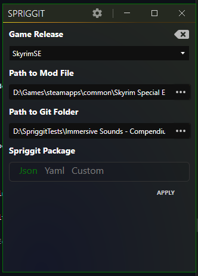
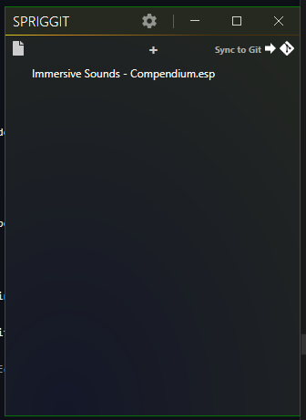

# Installation

## Install Latest .NET SDK
You can get the typical SDK installation from Microsoft's official page

[:octicons-arrow-right-24: Download SDK](https://dotnet.microsoft.com/download)

!!! tip "Restart"
    It's usually a good idea to restart your computer after installing DotNet SDK to help things settle in.

This step is needed by the "engine" in order to download the Spriggit translation packages via `dotnet tool install`.  [More info here](translation-packages.md).

## Download Spriggit Exe
Spriggit comes as a UI and a Command Line Interface.   Both can be downloaded from the github releases page

[:octicons-arrow-right-24: Download](https://github.com/Mutagen-Modding/Spriggit/releases)

### Spriggit UI
This is a self-contained WPF application, which can only run on Windows.  You can add links between a mod file and where it should be translated to, and then sync back and forth with one click.

### Spriggit CLI
Spriggit comes with a Command Line Interface that can be used to convert from Betheseda Plugins to Git Repositories, and back.   

!!! tip "UI Can Also Run as a CLI"
    The UI executable can also be run as a command line interface.

For more details on the various commands that can be run:

[:octicons-arrow-right-24: Command Line Interface](cli.md)
