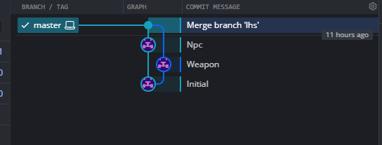
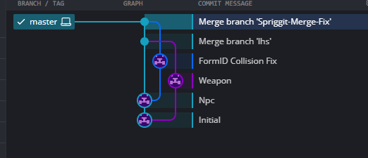

# Merge Conflicts

One of the powerful concepts that Spriggit + Git opens up is the ability to work on several branches in parallel.   Inevitably, this work needs to be merged together at some point, which can result in merge conflicts.

## Typical Content Conflicts

Merge conflicts are normal, but do need to be dealt with when they arise.  Typically this will arise if two sides modified the same fields on a record, where it's unsure which change you wanted to keep in the final result.

You can google more about general Git merge conflict handling

[:octicons-arrow-right-24: Git Merge Conflicts](https://www.gitkraken.com/learn/git/tutorials/how-to-resolve-merge-conflict-in-git)

## FormID Collision
A concept that is unique to Bethesda mods and Spriggit is when FormIDs collide.

When new records are added, a FormID is claimed.   If two people working in parallel create a new record, then they both might claim the same FormID.   When merging their changes, this results in a duplicate FormID within the mod, which is not allowed.

This will not result in a typical Git Merge Conflict, but it something to check for and fix after every merge.

### Fixing FormID Collision
Spriggit comes with tooling to detect and fix these FormID collisions.  It is recommended to do this after every merge.

[:octicons-arrow-right-24: CLI Command](cli.md#formid-collision-fixing)

This tool fixes the FormID collisions by modifying one of the records involved in the collision to have a new FormID, and also rerouting any reference to it within the mod to point to that new record.

Here is an example of some work being done in parallel, where one side added an Npc, and the other a Weapon, both of which would have claimed the same FormID:

After running the tool, an extra commit adjusting one of the records has been added and merged in to de-collide the records:

!!! bug "Two Collisions Maximum"
    The logic that Spriggit contains to handle FormID conflicts can only handle two records with a single FormID.  As such, collisions need to be handled immediately after each Git merge.
	