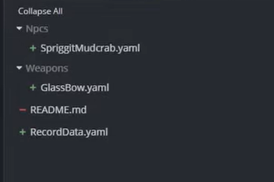

# Output
Spriggit processes Bethesda plugins into a format that Git can support.

## Example Record Output

!!! info "Yaml or Json"
    Yaml or Json formatting is currently supported

Here is a snippet of what a record file might look like if Yaml output is used:
```yaml
FormKey: 087835:Skyrim.esm
EditorID: JewelryNecklaceGoldGems
ObjectBounds:
  First: -3, -9, 0
  Second: 3, 9, 1
Name: Gold Jeweled Necklace
WorldModel:
  Male:
    Model:
      File: Armor\AmuletsandRings\GoldAmuletGemsGO.nif
      Data: 0x020000000300000000000000A4E51E5364647300D8C674AFC031228D64647300D8C674AFB8EC307B64647300262C333B
PickUpSound: 08AB15:Immersive Sounds - Compendium.esp
PutDownSound: 08AB16:Immersive Sounds - Compendium.esp
Race: 013749:Skyrim.esm
Keywords:
- 06BBE9:Skyrim.esm
- 08F95A:Skyrim.esm
- 0A8664:Skyrim.esm
- 10CD0A:Skyrim.esm
Armature:
- 09171F:Skyrim.esm
Value: 485
Weight: 0.5
```

This file is more palatable to Git and can support diff tools and similar functionality.


## Mods are Split into Folders
Rather than having one large file of all of a mod's data, Spriggit splits a mod into a folder of files.

A typical mod folder structure might look like:
```
Some/Dedicated/Mod/Folder/  -  A folder dedicated to storing Spriggit content for a single mod
   RecordData.yaml          -  The mod header
   Weapons/                 -  Folder for all the weapons
      GlassDagger.yaml      -  File dedicated to the record Glass Dagger
      IronLongsword.yaml    -  Seperate file for the Iron Longsword
   Npcs/                    -  Folder for all the weapons
      Goblin.yaml           -  File dedicated to the Goblin's data
```

{ align=right width="450" }

This folder structure helps organize git diffs to be more meaningful.  If a new record is added, then this will be seen as a new file.   If a record is modified, it will be a modified file.   Similar to wanting to avoid having a program's code be in one large monolith file, having smaller bite sized files helps navigate and digest changes being made.
